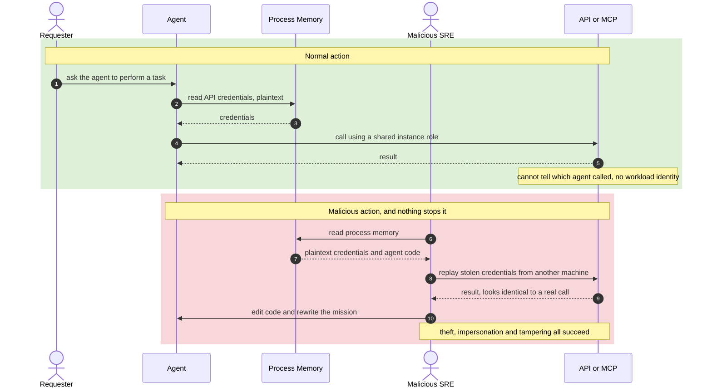
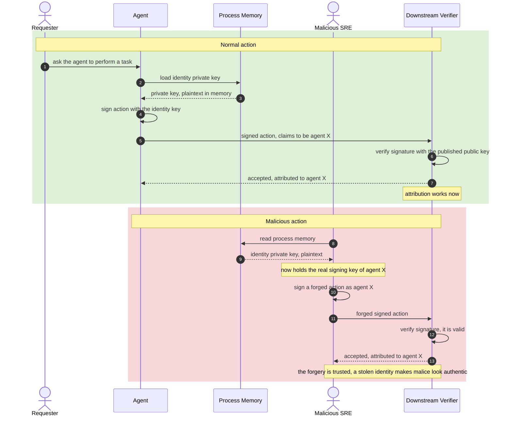
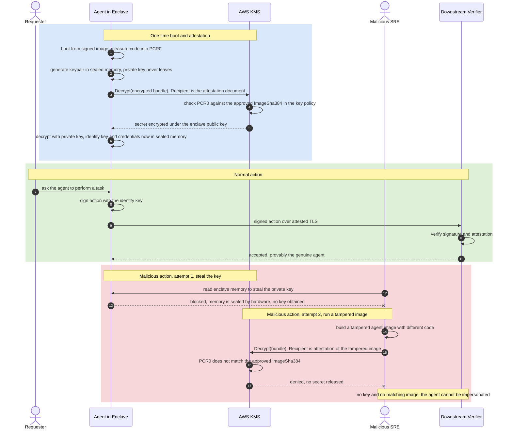

# Securing Agentic AI with Workload Identity and Confidential Computing

Agentic AI systems act on their own. They drive browsers, call tools and APIs, query databases, talk to MCP servers, and sometimes spawn other agents, all without a human approving each step. That autonomy combined with broad access is what makes their security model different from ordinary automation. This document explains why an agent needs both a verifiable identity and a protected runtime, what breaks when either is missing, and how the two combine to close the gap. Each scenario below includes an auth flow diagram that shows a normal action and a malicious action side by side, so you can see exactly what an attacker can and cannot do.

## TL;DR

An agent needs two things to operate safely. It needs an identity so its actions can be attributed to it, and it needs that identity and its secrets protected from whoever runs the infrastructure. Workload identity on its own gives you attribution but leaves the signing key readable by any operator, so a stolen key produces forgeries that look authentic. Confidential computing seals the runtime so the key cannot be read, and proves the code is the approved image, so a tampered agent gets no secrets and cannot act. You need both. Identity gives the name, confidential computing keeps the secret behind the name unreadable and proves the code behind the name is genuine.

## Why agentic AI changes the security picture

A traditional automation runs a fixed script that a human reviewed before it shipped. An agent decides what to do at run time, chains multiple tool calls, and can take actions with real-world consequences such as moving money, changing records, or sending messages. Two consequences follow. First, the blast radius of a compromised or impersonated agent is large. Second, attribution matters, because you need to know which agent took an action and on whose authority. Both points push you toward a strong, verifiable identity and a runtime that an attacker cannot quietly subvert.

## What every agent needs, and the two properties that protect it

The Confidential Computing Consortium frames this cleanly. Most agents need an identity and a way to authorise actions. The standard way to give an identity is a unique identifier such as a UUID or a SPIFFE SVID. The standard way to give an agent the power to act is a private cryptographic key, where the public half is published and the private half is kept secret.

These two artifacts need opposite forms of protection.

The identity needs integrity protection. The identifier itself is not secret. What matters is that nobody can forge it or change it. If an attacker can repoint the identity, you can have no assurance that the agent you are talking to is the correct one.

The capability needs confidentiality protection. The private key is the thing that proves the agent may act. If it leaks, the thief inherits everything you delegated, from reading private files to charging a company card. So the key must stay secret.

This is the classic split. You do not hide the name badge, you make sure it cannot be counterfeited. You do not publish the key, you make sure nobody can read it.

## Threat model

The adversary worth designing against is not only an external hacker. It is anyone with control of the infrastructure the agent runs on. On standard computing, whoever controls the machine controls everything on it, including the memory of every process. That covers a system administrator or SRE who logs into the host, and it also covers the kernel and the hypervisor. A cloud tenant does not control those layers. So the question for each scenario is simple. Can an operator with full access to the box read the agent's secrets, change its code, or impersonate it, and can the systems it talks to tell the difference.

## Scenario 1. No workload identity and no confidential computing

This is the baseline. The agent is just a process. Its credentials sit in plaintext in environment variables, configuration, or memory, and its code and instructions sit alongside them. There is no identity, so the systems it calls see only a shared role and cannot attribute an action to a specific agent.

Nothing protects any of it. An operator reads process memory and walks away with the credentials, then replays them from anywhere. The same operator edits the code or rewrites the mission. The data the agent handles is visible while it runs. Theft, impersonation, and tampering all succeed, and there is no record of which agent did what.

## Scenario 2. Workload identity but no confidential computing

Now the agent has a workload identity, for example a SPIFFE SVID backed by a private signing key, or an OIDC based identity. Every action it takes is signed, and the systems it calls verify the signature and attribute the action to that specific agent. This is a real improvement, because you finally have provenance.

The problem is that the private key still lives in plaintext in memory, on infrastructure the operator controls. An operator reads memory and steals the key. From that moment they can mint perfectly valid signed actions as the agent, from any machine, and the downstream verifier accepts them because the signature is genuine. The operator can also rewrite the mission, and the tampered agent signs its malicious actions with the real identity. Identity without isolation is forgeable, and a stolen identity is arguably worse than none, because the forgeries now carry a trusted signature.

## Scenario 3. Workload identity and confidential computing together

Here the agent runs inside a hardware Trusted Execution Environment, for example an AWS Nitro Enclave. Two new guarantees appear.

The runtime is sealed. The memory the agent uses is protected from viewing and tampering by everything else on the machine, including the administrator, the kernel, and the hypervisor. The operator cannot read the signing key, so it cannot be stolen, and cannot change the running code.

The code is measured and proven. At boot the enclave hashes its own image into a measurement called PCR0. To obtain its secrets, the enclave presents an attestation document, and the key service releases the secrets only if that measurement matches the approved image. A tampered image produces a different measurement, so it gets nothing.

The outcome is that both halves from earlier hold at once. The signing key is unreadable, so capability confidentiality holds. The code is pinned by attestation, so identity and mission integrity hold. The systems the agent talks to get a signed action and can verify the attestation, so provenance is real. The malicious operator is defeated not by being caught in the act, but because the two things they would need, the key and a matching image, are simply unavailable to them.

## How the attestation actually works, AWS Nitro Enclaves and KMS

The attestation is not on the data path. It runs once at startup to unlock the material that then authenticates every later call. The flow on AWS looks like the following.

1. The enclave boots from a signed image and measures its code into PCR0.
2. Inside the sealed memory it generates a fresh keypair. The private half never leaves the enclave.
3. It builds an attestation document that contains its PCR measurements and its new public key.
4. The agent calls a KMS operation such as Decrypt and passes the attestation document in the Recipient parameter. The encrypted bundle holds the agent's identity key, its credentials, and optionally its instructions.
5. KMS compares the measurement in the document against a condition in the key policy. The condition `kms:RecipientAttestation:ImageSha384` corresponds to PCR0, the hash of the approved image.
6. If it matches, KMS encrypts the plaintext under the enclave public key and returns ciphertext that only the enclave private key can decrypt.
7. The enclave decrypts the bundle in sealed memory. From here it signs actions and makes ordinary authenticated calls to data sources, APIs, and MCP servers, which trust the credential because only a verified enclave could have unlocked it.

Re-attestation happens on a boundary, not per request. A new enclave launch, a credential or token expiry, or a secret rotation. This is also the natural design pressure, since an autonomous agent makes many calls and you do not want a key service round trip wrapped around each one.

Gating the instructions through the same mechanism is how you stop an operator from swapping the agent's mission. If the instructions are part of the bundle, a tampered image fails the measurement check and never receives them.

## What confidential computing does and does not give you

Confidential computing shifts trust, it does not remove it. You stop trusting the operator, the kernel, and the hypervisor, and you start trusting the hardware vendor's root of trust, the firmware, and whoever verifies the attestation. That is usually a far smaller and more accountable set of parties, which is the whole point.

It is also only as complete as the boundary of the enclave. A common gap today is that some confidential virtual machine setups protect CPU memory but leave GPU memory, model weights, and input output buffers exposed to the hypervisor. For agentic AI that leans heavily on GPUs this matters, which is why GPU based confidential computing and end to end isolation of the whole pipeline are active areas of work.

## Summary

| Scenario | Action attribution | Key stays secret | Code and mission protected | Net result |
| --- | --- | --- | --- | --- |
| No identity, no confidential compute | No, shared role only | No, plaintext in memory | No | Theft, impersonation, and tampering all succeed, with no provenance |
| Identity, no confidential compute | Yes, until the key is stolen | No, plaintext in memory | No | Attribution works, but a stolen key yields authentic looking forgeries |
| Identity and confidential compute | Yes, and verifiable by attestation | Yes, sealed in the enclave | Yes, pinned by PCR0 | Operator cannot read the key or pass a tampered image, so the agent cannot be impersonated |

## References

- Confidential Computing Consortium, Protecting Agentic AI Workloads with Confidential Computing. https://confidentialcomputing.io/2026/01/20/protecting-agentic-ai-workloads-with-confidential-computing/
- AWS Nitro Enclaves, Enclave workflow overview. https://docs.aws.amazon.com/enclaves/latest/user/flow.html
- AWS Nitro Enclaves, Cryptographic attestation. https://docs.aws.amazon.com/enclaves/latest/user/set-up-attestation.html
- AWS Key Management Service, Condition keys for AWS Nitro Enclaves. https://docs.aws.amazon.com/kms/latest/developerguide/conditions-nitro-enclaves.html
